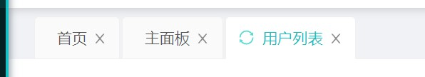
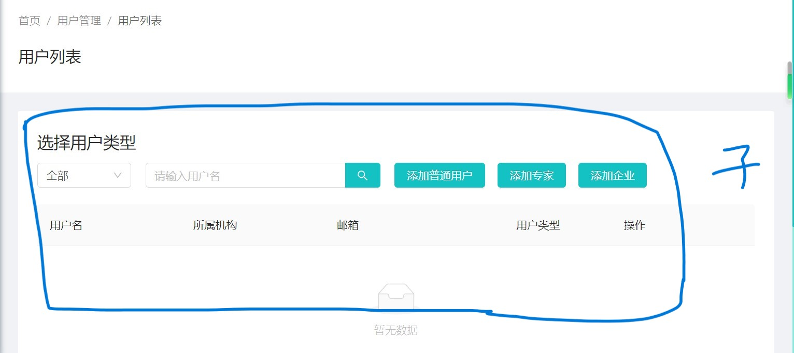

# Manager 

## 外层TabsView

- 整个逻辑在configs

- 首页最外层是TabsView，它负责整个页面设计，包括了页签内容区域的展示和切换逻辑，以及一些其他的功能，比如页面的加载、缓存管理等。

- TabsView包含TabsHead，它负责责显示页签头部分，包括页签的标题、关闭按钮、刷新按钮等，以及一些交互功能，如点击页签切换页面、右键菜单等

  

- TabsView给剩余的用户管理、成果解读等子组件提供容器

## 内层子页面

- 以用户管理为例

- 外层是PageView，PageView其实是由PageLayOut构成，PageLayOut又分成了上面的pageHeader和下面的子路由部分

  